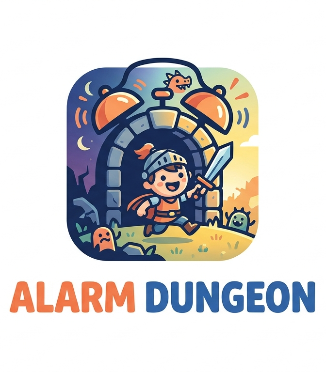
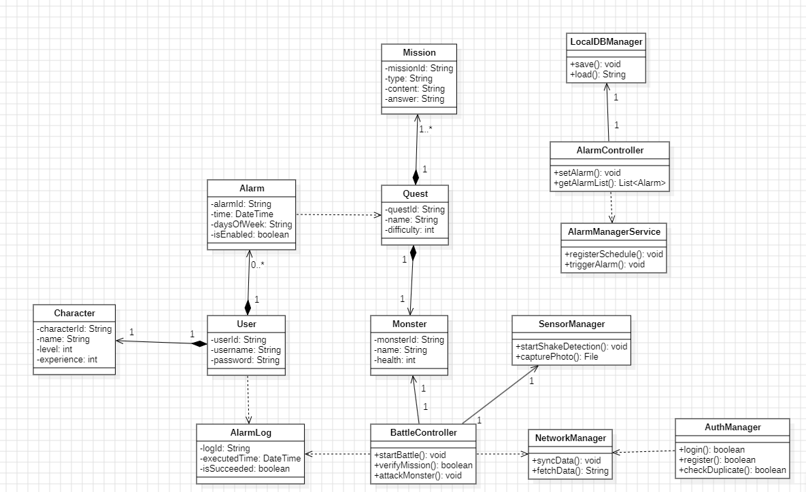
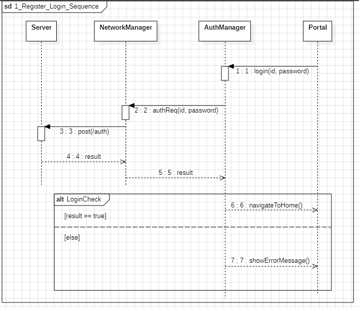
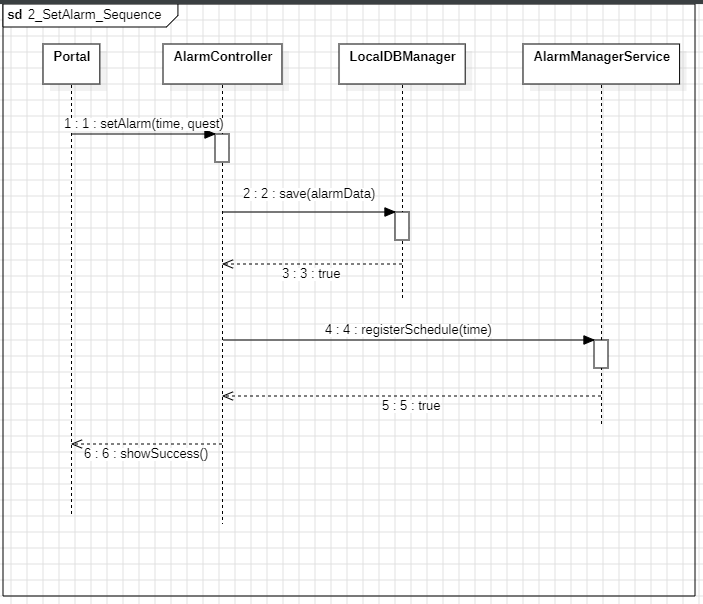
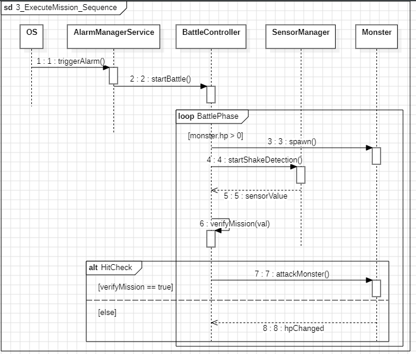
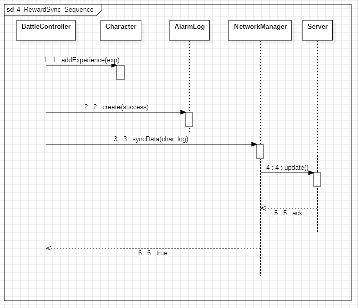
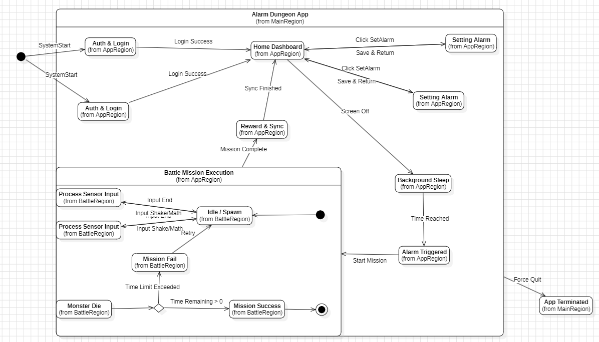

# 3. Design

## ALARM DUNGEON (알람 RPG: 던전 탈출)

**학번 (Student No.):** 22212020  
**이름 (Name):** 장우석  
**이메일 (E-mail):** wkddntjr803@naver.com  

### [ Revision history ]

| Revision date | Version # | Description | Author |
| :--- | :--- | :--- | :--- |
| 2026/05/31 | 1.00 | First Draft | 장우석 |

---

## = Contents =
1. Introduction
2. Class diagram
3. Sequence diagram
4. State machine diagram
5. Implementation requirements
6. Glossary
7. References

---

## 1. Introduction

### 1. Summary
현대 사회를 살아가는 사람들은 매일 아침 기상이라는 과제에 직면한다. 대부분 스마트폰 알람을 사용하지만, 뇌가 깨기 전 무의식적으로 알람을 종료하고 다시 잠드는 '2차 수면' 문제가 빈번하다. 알람 소리가 단순한 성가신 소음으로 인식되어 아침의 시작을 피로하게 만드는 이 문제를 해결하고, 기상 자체에 직관적이고 확실한 재미와 동기를 부여하기 위해 만든 앱이 바로 "ALARM DUNGEON"이다.

### 2. Introduce "ALARM DUNGEON"
이번에 제작하게 된 앱 "ALARM DUNGEON"은 기상 알람에 RPG 게임의 전투(데스매치 및 PvE) 요소를 결합한 시스템이다. 단순히 알람이 울리면 끄는 방식이 아니라, Enemy(몬스터) 오브젝트가 등장하여 수학 퀴즈나 기기 흔들기(가속도 센서) 등의 미션을 수행해야만 대미지를 입히고 알람을 종료할 수 있다. 미션 성공 시 캐릭터 경험치를 획득하여 성장시키는 보상 체계를 제공함으로써, 아침 기상에 확실한 목표 의식과 성취감을 제공한다.

### 3. Goal
이번 Design 보고서에서는 Use case에 대해 Sequence Diagram을 그리고 내부 동작 과정을 상세히 소개한다. 또한 해당 프로젝트에서 사용한 각종 컨트롤러(Controller) 및 매니저(Manager) 클래스에 대해 소개하며 어떤 기능을 담당하는지 설명한다. 앱이 동작할 때의 StateMachine Diagram을 그려 시스템이 어떤 상태로 변화할 수 있는지 보여준다. 해당 보고서를 읽고 나면 "ALARM DUNGEON"의 클라이언트와 시스템 통신 방식이 어떤 구조로 디자인되었는지 명확히 알 수 있다.

---

## 2. Class diagram

해당 프로젝트는 모바일 플랫폼(Flutter/Dart 기반)과 백엔드 시스템 간의 통신 구조를 사용하여 진행된다. 기능 분리를 위해 순수 데이터 모델 클래스와 로직을 담당하는 Manager/Controller 클래스를 명확히 분리하여 설계하였다. 
특히, 실제 구현(Implementation) 단계로 넘어갈 때 Flutter의 상태 관리 패턴(Provider 등)과 자연스럽게 결합할 수 있도록, 각 Controller들은 UI 계층과 비즈니스 로직을 분리하는 핵심 역할을 수행한다.

### (1) 데이터 모델 (Data Models)

| 클래스 명 | 설명 |
| :--- | :--- |
| **User** | 시스템을 사용하는 사용자 계정 정보를 관리한다. - `userId`, `username`, `password` 등의 인증 정보를 포함한다. |
| **Character** | 사용자가 플레이하는 게임 내 아바타 객체이다. - `characterId`, `name`, `level`, `experience`를 관리하며 알람 해제 시 성장한다. |
| **Alarm** | 사용자가 설정한 기상 시간 객체이다. - `alarmId`, `time`, `daysOfWeek`, `isEnabled` 등 스케줄 데이터를 지닌다. |
| **Quest / Mission** | 알람 시 발동할 퀘스트와 내부 세부 과제를 정의한다. - `type`(수학, 흔들기 등)과 `difficulty`(난이도), `answer`를 포함한다. |
| **Monster** | 퀘스트에 출현하는 적 오브젝트이다. - `health`(체력)을 가지며 미션 성공 시 피해를 입는다. |
| **AlarmLog** | 알람 수행 기록 객체이다. - `executedTime`, `isSucceeded` 등을 통해 사용자의 기상 통계를 구성한다. |

### (2) 시스템 컨트롤러 및 매니저 (Controllers & Managers)

| 클래스 명 | 설명 |
| :--- | :--- |
| **AuthManager** | 사용자 인증을 총괄하는 클래스이다. `+login()`, `+register()`, `+checkDuplicate()`: 입력받은 데이터를 검증하고 네트워크 매니저를 통해 서버와 통신한다. |
| **AlarmController** | 알람 데이터 생성 및 수정 로직을 담당한다. `+setAlarm()`, `+getAlarmList()`: 알람 시간과 퀘스트 정보를 조합하여 저장소를 호출한다. |
| **AlarmManagerService** | 모바일 OS(Android/iOS)의 네이티브 알람 API와 통신하는 클래스이다. `+registerSchedule()`: OS 백그라운드에 알람 예약. `+triggerAlarm()`: 시간이 되면 앱을 포그라운드로 호출한다. |
| **BattleController** | 몬스터와의 전투(알람 해제 미션) 흐름을 관리한다. `+startBattle()`, `+verifyMission()`, `+attackMonster()`: 사용자의 입력(미션 정답)을 판정하고 몬스터 체력을 관리한다. |
| **SensorManager** | 기기 흔들기 등의 물리적 행동 미션을 위해 OS 센서 값을 읽어온다. `+startShakeDetection()`, `+capturePhoto()`: 가속도계 데이터나 카메라 스트림을 제어한다. |
| **NetworkManager** | 외부 게임 서버와의 비동기 데이터 통신을 담당한다. `+syncData()`, `+fetchData()`: 로컬 데이터를 서버에 백업하거나 불러온다. |
| **LocalDBManager** | SQLite 기반의 로컬 캐시 저장을 담당한다. `+save()`, `+load()`: 오프라인 상태에서도 알람과 캐릭터 데이터를 보존한다. |

---

## 3. Sequence diagram

### 1) Register & Login

사용자가 앱에 처음 진입하여 계정을 생성하거나 로그인하는 Use case에서의 Sequence Diagram이다.
사용자가 로그인 UI에서 아이디와 패스워드를 입력 후 버튼을 누르면, `AuthManager`가 이를 처리하여 유효성을 판단한다. 이후 `AuthManager`에서 처리된 요청은 `NetworkManager`를 통해 서버(Server)로 전달되며, 서버는 데이터베이스를 조회하여 결과를 반환한다. 성공 시 사용자는 메인 로비(홈 화면)로 이동하게 된다.

### 2) Set Alarm & Select Quest

기상 알람 및 연동될 던전(퀘스트)을 설정하는 Use case에 대한 Sequence Diagram이다.
사용자가 알람 설정 화면에서 시간과 퀘스트 종류를 선택하고 저장 버튼을 누르면, `AlarmController`에서 이를 감지한다. `AlarmController`는 우선 네트워크 단절에 대비해 `LocalDBManager`에 `save()`를 요청하여 데이터를 로컬에 기록한다. 그 직후, 앱이 종료되더라도 정해진 시간에 깨어나야 하므로 `AlarmManagerService`의 `registerSchedule()`을 호출하여 모바일 OS의 스케줄러에 알람 인텐트를 등록한다. 모든 과정이 완료되면 사용자는 알람 설정 완료 메시지를 받는다.

### 3) Trigger Alarm & Execute Mission (Battle)

실제 기상 시간에 맞춰 알람이 울리고 몬스터와 전투하는 Use case에 대한 Sequence Diagram이다.
설정된 시간이 되면 OS로부터 `AlarmManagerService`가 `triggerAlarm()` 신호를 받아 앱을 깨우고 전투 화면을 띄운다. 
`BattleController`는 `startBattle()`을 호출해 몬스터(Monster) 객체를 렌더링한다. 사용자가 퀴즈를 풀거나 기기를 흔드는 행위를 하면, `SensorManager` 및 UI를 통해 값이 수집된다. 수집된 값은 `BattleController`의 `verifyMission()`을 거치게 되며, 정답이거나 목표 흔들기 횟수에 도달하면 `attackMonster()`를 통해 Monster의 체력(Health)을 차감한다. 체력이 0이 될 때까지 이 과정이 반복된다.

### 4) Reward & Data Sync

몬스터를 처치하고 전투가 종료된 후의 Use case에 대한 Sequence Diagram이다.
몬스터 체력이 0이 되어 처치되면, `BattleController`는 `Character` 객체에 경험치 추가를 지시하고, 기상 성공 통계를 남기기 위해 `AlarmLog` 객체를 생성한다.
이후 `NetworkManager`의 `syncData()`를 호출하여 서버에 전투 결과와 새로운 캐릭터 레벨을 백업 요청한다. 서버와의 동기화가 끝나면 로컬의 데이터 일관성을 맞추고, 사용자에게 성공화면과 함께 획득한 보상을 표시한다.

---

## 4. State machine diagram

유저가 앱을 처음 실행하면 `LoggedOut` 상태에서 서버와 접속을 시도한다. 인증에 성공하면 `Home_Dashboard` 상태가 되며 자신의 캐릭터와 현재 활성화된 알람들을 볼 수 있다.
유저가 알람을 추가하거나 수정하기 위해 메뉴로 진입하면 `SettingAlarm` 상태가 되며, 저장이 완료되면 다시 홈으로 돌아온다. 이후 유저가 화면을 끄고 잠자리에 들면 앱은 시스템 리소스 소모를 최소화하는 `Background_Sleep` 상태로 대기한다.

시간이 다 되어 모바일 OS로부터 신호가 오면 강제로 `AlarmTriggered_Battle` 상태로 전환된다. 이때 몬스터가 출현하며 유저는 미션을 수행해 타격을 입혀야 단다. 만약 제한된 시간 내에 미션을 실패하거나 포기하면 `MissionFail` 상태로 가며 알람 로그에 실패 기록을 남긴다. 몬스터의 체력을 0으로 깎아 성공하면 `MissionSuccess` 상태로 전이되어 경험치와 레벨업 판정을 처리한다. 이후 결과 보상을 확인하고 나면 앱은 다시 `Home_Dashboard` 상태로 완전히 복귀하여 다음 알람을 대기한다.

---

## 5. Implementation requirements

### 5.1 H/W platform requirements
- **Processor** : 1.5 GHz Quad-core+ (Snapdragon 600 Series / Apple A10 Fusion+)
- **RAM** : 2GB+
- **Storage(HDD/SSD)** : 150MB+ 가용 공간
- **Sensors** : 가속도계(Accelerometer), 자이로스코프 (흔들기 등 동적 미션 감지용)

### 5.2 S/W platform requirements
- **OS** : Android 9.0+ / iOS 14.0+
- **Implement Language / Framework** : Dart (Flutter)
- **State Management** : Provider (또는 Riverpod) 패턴을 이용한 상태 관리
- **Major Libraries** : `sensors_plus` (센서 감지), `alarm` (백그라운드 스케줄링)
- **Database** : PostgreSQL (Server), Isar / SQLite (Local)

---

## 6. Glossary

* **Gamification (게이미피케이션)** : 기상이라는 일상적이고 고통스러운 과정에 미션, 전투, 보상이라는 게임 메커니즘을 적용하여 사용자의 동기를 유발하는 기법.
* **Voxel (복셀)** : 부피(Volume)와 픽셀(Pixel)의 합성어. 3D 그래픽을 구성하는 블록 단위로, 본 게임의 시각적 디자인 테마로 사용됨.
* **AlarmManager** : 앱이 백그라운드나 종료된 상태에서도 특정 시각에 코드를 실행하도록 모바일 OS(Android)에서 제공하는 네이티브 시스템 서비스.
* **Sequence Diagram** : 객체 간의 동적 상호작용을 시간적 개념으로 모델링하여 나타낸 다이어그램.
* **StateMachine Diagram** : 프로그램 또는 객체의 LifeTime 동안 변화될 수 있는 모든 상태와 그 전이 과정을 정의해 둔 다이어그램.

---

## 7. References

- 강의자료 : Structural Modeling II, Behavior Modeling I, II
- 참고자료 : https://flutter.dev/docs (Flutter Official Documentation)
- 참고자료 : https://developer.android.com/reference/android/app/AlarmManager (Android AlarmManager API)
