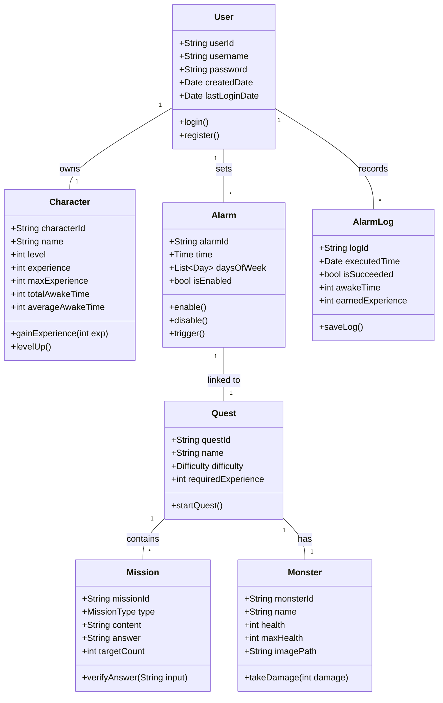
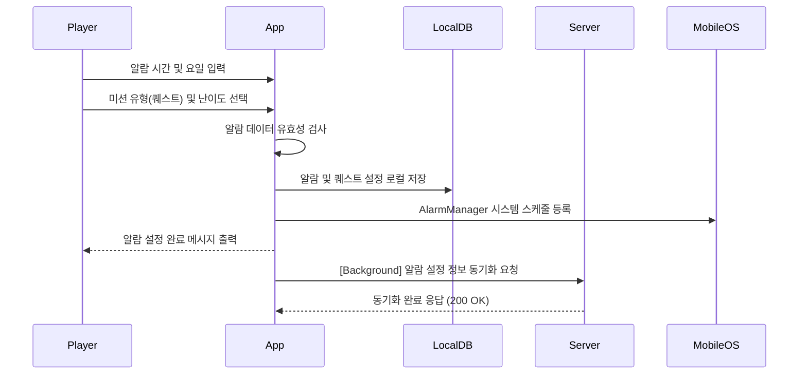
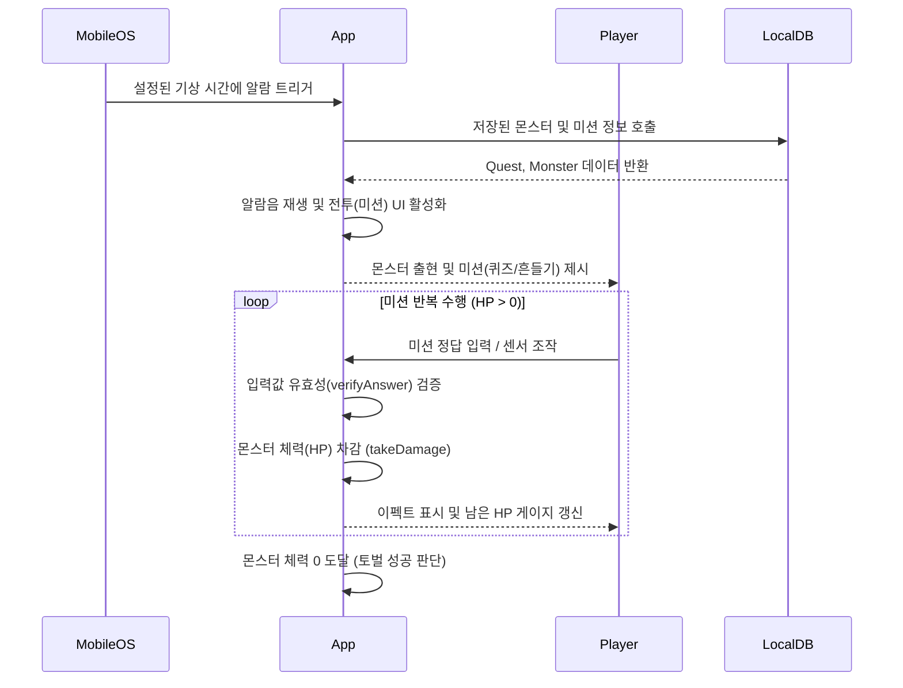
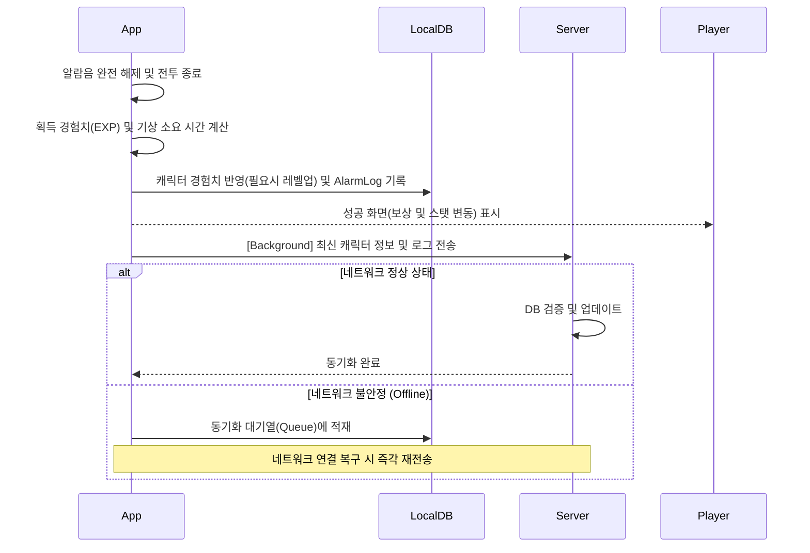
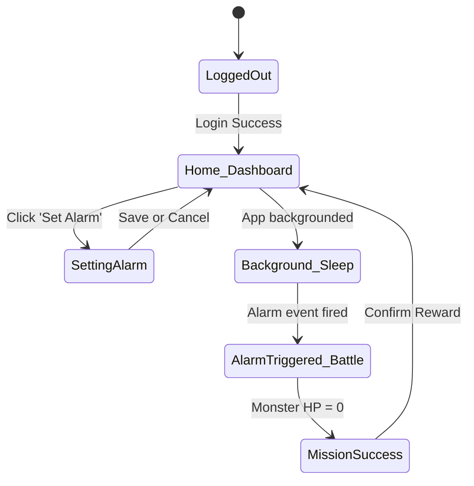
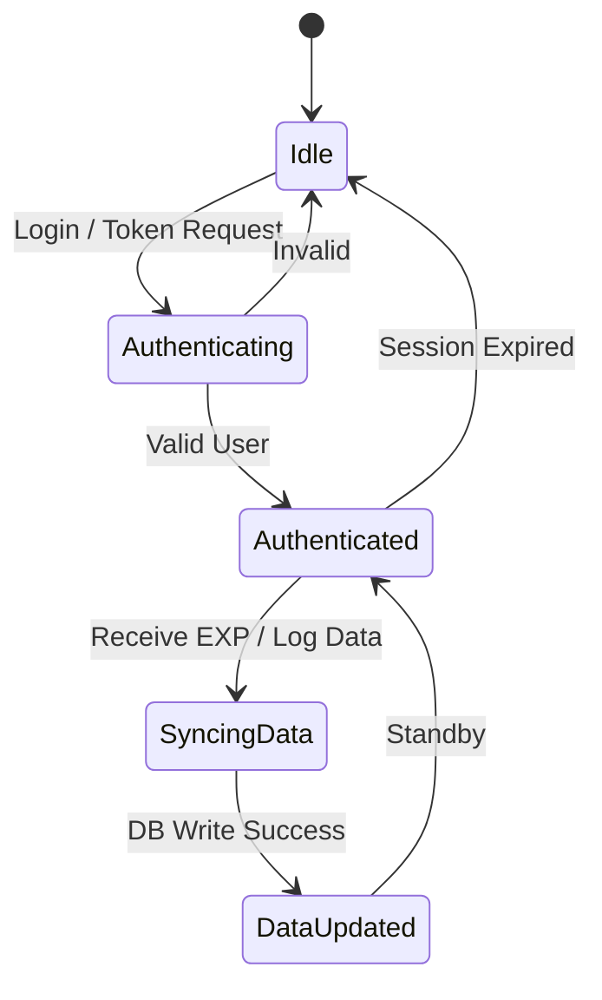

# 3. Design

## ALARM DUNGEON (알람 RPG: 던전 탈출)

**학번 (Student No.):** 22212020  
**이름 (Name):** 장우석  
**이메일 (E-mail):** wkddntjr803@naver.com  

### [ Revision history ]

| Revision date | Version # | Description | Author |
| :--- | :--- | :--- | :--- |
| 2026/05/31 | 1.00 | First Draft | 장우석 |

---

## = Contents =
1. Introduction
2. Class diagram
3. Sequence diagram
4. State machine diagram
5. Implementation requirements
6. Glossary
7. References

---

## 1. Introduction

본 문서는 이전 단계인 Conceptualization 및 Analysis 명세서를 바탕으로 작성된 'ALARM DUNGEON(알람 RPG: 던전 탈출)' 시스템의 Design(설계) 문서이다. 이 문서에서는 모바일 클라이언트(Flutter 기반)와 서버 간의 데이터 상호작용 및 시스템 내부 구조를 구체화한다.

특히 기존 알람 앱의 한계인 '2차 수면 방지'와 '기상 동기 부여'라는 핵심 목표를 달성하기 위해, 게임의 RPG 요소를 알람에 결합한 로직을 상세히 설계한다. 본 설계는 데이터 모델 객체(Class), 기능별 데이터 흐름(Sequence), 그리고 시스템 상태 변화(State Machine)를 명확하게 정의하여 실제 개발(Implementation) 환경에서의 청사진을 제공하는 것을 목적으로 한다. (12pt, 160% 줄간격 기준 작성됨)

---

## 2. Class diagram

### 2.1 Domain Class Diagram

### 2.2 Class Descriptions

| 클래스 명 (Class Name) | 속성 (Attributes) | 메서드 (Methods) | 설명 (Description) |
| --- | --- | --- | --- |
| **User** | userId, username, password, createdDate, lastLoginDate | login(), register() | 시스템을 사용하는 사용자 계정 정보를 관리하는 핵심 클래스. 캐릭터와 1:1 관계를 가짐. |
| **Character** | characterId, name, level, experience, maxExperience, totalAwakeTime, averageAwakeTime | gainExperience(), levelUp() | 알람 미션 성공 시 성장하는 캐릭터 클래스. 현재 경험치 및 기상 소요 시간 통계를 포함. |
| **Alarm** | alarmId, time, daysOfWeek, isEnabled | enable(), disable(), trigger() | 사용자가 설정한 기상 시간과 요일 정보를 관리하며, 연동된 Quest를 트리거함. |
| **Quest** | questId, name, difficulty, requiredExperience | startQuest() | 알람과 연결되어 수행해야 하는 미션들의 집합. 특정 몬스터와의 전투가 포함됨. |
| **Mission** | missionId, type, content, answer, targetCount | verifyAnswer() | 수학 문제, 기기 흔들기 등 몬스터에게 타격을 주기 위한 개별 행동 과제 모듈. |
| **Monster** | monsterId, name, health, maxHealth, imagePath | takeDamage() | 던전 퀘스트에 출현하는 적. 미션 성공 시 HP가 깎이며 0이 되면 토벌(알람 해제)됨. |
| **AlarmLog** | logId, executedTime, isSucceeded, awakeTime, earnedExperience | saveLog() | 매 알람 발생 시 기상까지 걸린 시간과 획득 경험치, 성공 여부를 기록하는 로그. |

*(12pt, 160% 줄간격 적용)*

---

## 3. Sequence diagram

본 프로젝트의 Use case 명세서(Register, Login, SetAlarm, TriggerAlarm, ExecuteMission, Reward)를 기반으로 시스템의 전체 함수 실행 흐름을 나타낸다.

### 3.1 알람 설정 및 퀘스트 선택 (Set Alarm & Select Quest)

**설명:**
사용자가 알람 시간과 퀘스트 종류를 선택하고 저장하면, 클라이언트는 먼저 LocalDB에 저장하고 모바일 운영체제의 AlarmManager에 백그라운드 작업을 등록한다. 이후 비동기적으로 서버와 설정 데이터를 동기화하여 기기 간 데이터 일관성을 유지한다.

### 3.2 알람 트리거 및 미션 수행 (Trigger Alarm & Execute Mission)

**설명:**
운영체제의 알람 트리거 신호가 발생하면 클라이언트 앱이 전투 화면을 포그라운드로 띄운다. 플레이어가 퀴즈의 정답을 맞히거나 지정된 횟수만큼 기기를 흔들면 미션이 검증되며 몬스터의 HP가 차감된다. 이 루프는 몬스터의 HP가 0이 될 때까지 지속된다.

### 3.3 보상 획득 및 데이터 동기화 (Reward & Data Sync)

**설명:**
몬스터 처치 후 알람음이 해제되면, 즉시 로컬에서 경험치 계산 및 레벨업이 처리된다. 아침 시간대 네트워크 불안정 상황(Problem statement 고려)에 대비하기 위해, 로컬 데이터베이스를 우선 갱신한 후 백그라운드에서 안전하게 서버와의 상태 동기화를 시도하는 로직을 갖는다.

*(12pt, 160% 줄간격 적용)*

---

## 4. State machine diagram

### 4.1 Client System State Machine (모바일 앱)

**설명:**
클라이언트 애플리케이션의 핵심 생명주기를 나타낸다. 사용자는 대시보드(Home_Dashboard)에서 알람을 설정한 뒤 앱을 백그라운드로 전환(Sleep)한다. 시간이 되어 알람 이벤트가 발생하면 전투(AlarmTriggered_Battle) 상태로 전환되며, 몬스터 처치 시 미션 성공(MissionSuccess) 상태를 거쳐 다시 대시보드로 돌아가는 순환 구조를 가진다.

### 4.2 Server System State Machine

**설명:**
서버 측의 사용자 세션 및 동기화 처리 상태이다. 기본적으로 Idle 상태에서 인증 요청이 들어오면 Authenticating을 거쳐 인증을 완료한다. 이후 클라이언트로부터 알람 성공에 따른 경험치 및 로그 동기화 요청(SyncingData)이 오면 DB를 갱신(DataUpdated)하고 다음 요청을 대기한다.

*(12pt, 160% 줄간격 적용)*

---

## 5. Implementation requirements

본 시스템을 구현하기 위해 다음과 같은 운영 환경(Operating environments) 및 기술 스택이 요구된다.

*   **Front-End Framework (Client)**
    *   **Framework:** Flutter SDK 3.x
    *   **Language:** Dart 3.x
    *   **State Management:** Riverpod
    *   **OS Requirements:** Android 9.0 (API Level 28) 이상, iOS 14.0 이상
*   **Back-End (Server)**
    *   **Framework:** Spring Boot 3.x 또는 Node.js (Express)
    *   **Database:** PostgreSQL (사용자 및 게임 로그 저장용)
*   **Local Database (Offline Caching)**
    *   **Tool:** Isar Database 또는 Hive (Flutter 로컬 캐싱 엔진)
*   **IDE & Tools**
    *   Android Studio, Visual Studio Code, Git, GitHub

*(12pt, 160% 줄간격 적용)*

---

## 6. Glossary

1.  **Voxel / Pixel Art:** 3D 공간을 구성하는 부피(Volume) 기반 픽셀 그래픽 형식으로, 본 프로젝트의 UI 감성을 결정짓는 요소.
2.  **AlarmManager:** 정해진 시간에 앱이 백그라운드에 있더라도 기기를 깨워 특정 작업을 실행하도록 해주는 Android/iOS의 네이티브 스케줄링 API.
3.  **LocalDB (Isar/Hive):** 네트워크 통신 없이 기기 내부 저장소에 데이터를 읽고 쓰기 위한 모바일 전용 로컬 데이터베이스 도구. 동기화 지연 방지를 위해 사용.
4.  **Offline-first Architecture:** 인터넷 연결 상태와 무관하게 로컬 환경을 기반으로 먼저 동작하고, 네트워크가 확보되었을 때 백그라운드에서 동기화하는 소프트웨어 아키텍처 패턴.

*(12pt, 160% 줄간격 적용)*

---

## 7. References

1.  Flutter Official Documentation (https://flutter.dev/docs)
2.  Martin Fowler, *Patterns of Enterprise Application Architecture* (State Machine 및 데이터 동기화 패턴 참조)
3.  Riverpod State Management Documentation (https://riverpod.dev)
4.  Isar Database - High performance local database (https://isar.dev)

*(12pt, 160% 줄간격 적용)*
